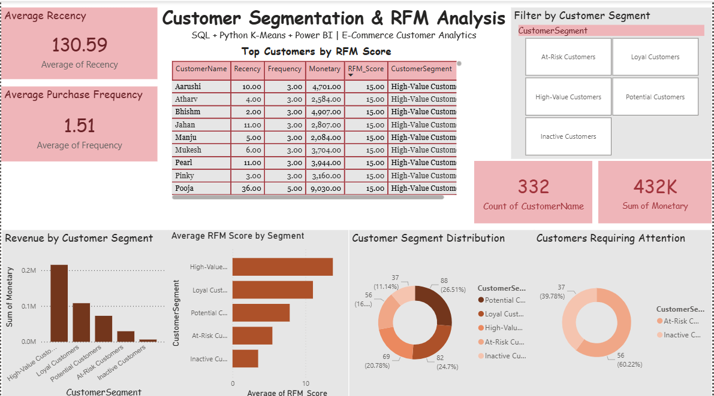

<div align="center">



# Customer Segmentation & RFM Analysis

### E-Commerce Customer Analytics using Python, K-Means, SQL Server & Power BI

</div>

---

## Project Overview

This project is an end-to-end E-Commerce Customer Analytics and Segmentation solution developed to understand customer purchasing behavior and identify meaningful customer groups.

The project combines Python, RFM Analysis, K-Means Clustering, SQL Server, and Power BI to transform raw e-commerce transaction data into actionable business insights.

The analysis focuses on identifying High-Value Customers, Loyal Customers, Potential Customers, At-Risk Customers, and Inactive Customers to support targeted marketing, customer retention, and revenue optimization.

---

## Project Objectives

- Analyze e-commerce customer purchasing behavior
- Calculate Recency, Frequency, and Monetary metrics
- Generate RFM scores for individual customers
- Apply K-Means clustering to identify customer groups
- Perform customer segmentation using SQL Server
- Analyze revenue contribution across customer segments
- Identify customers requiring attention
- Build an interactive Power BI dashboard
- Generate actionable business recommendations

---

## Technology Stack

| Technology | Purpose |
|---|---|
| Python | Data analysis and preprocessing |
| Pandas | Data manipulation and transformation |
| NumPy | Numerical operations |
| Scikit-learn | K-Means clustering |
| Jupyter Notebook | Python development and analysis |
| SQL Server | RFM analysis and customer segmentation |
| Power BI | Interactive dashboard and visualization |
| Microsoft Excel | Data preparation and supporting datasets |

---

## Project Architecture

```text
                    E-COMMERCE TRANSACTION DATA
                               |
                               v
                    DATA CLEANING & PREPARATION
                               |
                               v
                       PYTHON ANALYSIS
                               |
                +--------------+--------------+
                |                             |
                v                             v
          RFM CALCULATION              K-MEANS CLUSTERING
                |                             |
                v                             |
           RFM SCORING                        |
                |                             |
                +-------------+---------------+
                              |
                              v
                    SQL CUSTOMER SEGMENTATION
                              |
                              v
                     POWER BI DASHBOARD
                              |
                              v
                     BUSINESS INSIGHTS
---

## RFM Analysis

RFM Analysis is a customer segmentation technique that evaluates customers based on three key purchasing dimensions.

### Recency

Measures how recently a customer made a purchase.

A lower recency value generally represents more recent customer activity.

### Frequency

Measures how frequently a customer makes purchases.

A higher frequency indicates more frequent purchasing behavior.

### Monetary

Measures the total monetary value generated by a customer.

A higher monetary value indicates greater contribution to business revenue.

### RFM Score

Recency, Frequency, and Monetary values are converted into scores and combined to create an overall RFM Score for each customer.

Customers with stronger RFM characteristics can be prioritized for retention, loyalty, and personalized marketing strategies.

---

## K-Means Clustering

K-Means Clustering was used as the machine-learning component of this project.

The objective was to identify groups of customers with similar purchasing behavior based on their RFM characteristics.

The clustering process involved:

1. Preparing customer-level RFM data
2. Selecting relevant customer features
3. Applying K-Means clustering
4. Identifying customer groups
5. Interpreting the resulting clusters
6. Mapping the clusters to meaningful business segments

The clusters were evaluated based on:

- Recency
- Frequency
- Monetary value
- Overall purchasing behavior

---

## SQL Server Analysis

SQL Server was used for customer-level analytical processing and segmentation.

The SQL workflow includes:

Transaction Data
       |
       v
Customer-Level Aggregation
       |
       v
Recency Calculation
       |
       v
Frequency Calculation
       |
       v
Monetary Calculation
       |
       v
RFM Scoring
       |
       v
Customer Segmentation
       |
       v
Business Analysis
### SQL Analysis Includes

- Customer-level RFM calculation
- RFM scoring
- Customer segmentation
- Revenue analysis
- Customer counts
- Segment-level performance
- Average RFM analysis
- Top customer identification
- Identification of customers requiring attention

The main SQL analysis file is:

`Customer_Segmentation.sql`

---

## Customer Segmentation

The analysis identifies five major customer segments.

| Customer Segment | Business Interpretation |
|---|---|
| High-Value Customers | Customers generating strong overall monetary and engagement value |
| Loyal Customers | Customers showing consistent purchasing behavior |
| Potential Customers | Customers with potential for increased engagement and value |
| At-Risk Customers | Customers who may require targeted re-engagement |
| Inactive Customers | Customers showing low or limited recent activity |

---

## Power BI Dashboard

The final Power BI dashboard provides an interactive overview of customer behavior, revenue, RFM performance, and customer segmentation.

### Dashboard Components

- Average Recency
- Average Purchase Frequency
- Total Customers
- Total Monetary Value
- Top Customers by RFM Score
- Revenue by Customer Segment
- Average RFM Score by Segment
- Customer Segment Distribution
- Customers Requiring Attention
- Interactive Customer Segment Filter

### Dashboard Preview

<div align="center">


</div>

---

## Key Project Metrics

| Metric | Result |
|---|---:|
| Total Customers | 332 |
| Total Monetary Value | Approximately 432K |
| Average Recency | 130.59 |
| Average Purchase Frequency | 1.51 |

These metrics provide an overall view of customer activity, purchasing behavior, and revenue contribution.

---

## Business Insights

### High-Value Customers

High-value customers contribute strongly to overall customer value and revenue. They can be prioritized for loyalty programs, premium services, personalized offers, and exclusive products.

### Loyal Customers

Loyal customers demonstrate consistent purchasing behavior and represent an important customer base for long-term retention.

### Potential Customers

Potential customers represent an opportunity for increasing customer engagement and lifetime value through targeted promotions and personalized recommendations.

### At-Risk Customers

At-risk customers may have reduced engagement or purchasing activity. These customers can be targeted with re-engagement campaigns, personalized communication, and special offers.

### Inactive Customers

Inactive customers show limited recent activity and may require win-back campaigns or cost-effective retention strategies.

---

## Business Recommendations

| Segment | Recommended Strategy |
|---|---|
| High-Value Customers | Loyalty rewards, premium offers, personalized experiences |
| Loyal Customers | Loyalty programs, cross-selling, personalized recommendations |
| Potential Customers | Promotional campaigns, product recommendations, targeted offers |
| At-Risk Customers | Re-engagement campaigns, special discounts, personalized communication |
| Inactive Customers | Win-back campaigns and cost-effective retention strategies |

---

## Project Workflow

### Phase 1 — Data Preparation

Raw e-commerce transaction data was collected and prepared for analysis.

Data preparation included:

- Data loading
- Data cleaning
- Data transformation
- Customer-level aggregation

### Phase 2 — Python Analysis

Python was used for:

- Exploratory data analysis
- Data preprocessing
- Customer-level aggregation
- RFM calculation
- RFM scoring
- K-Means clustering

### Phase 3 — RFM Analysis

Recency, Frequency, and Monetary metrics were calculated for individual customers and converted into customer-level RFM scores.

### Phase 4 — Machine Learning

K-Means clustering was applied to identify groups of customers with similar purchasing behavior.

### Phase 5 — SQL Analysis

SQL Server was used for:

- RFM calculations
- RFM scoring
- Customer segmentation
- Revenue analysis
- Segment-level analysis
- Customer prioritization

### Phase 6 — Power BI

The processed customer segmentation data was visualized through an interactive Power BI dashboard.

### Phase 7 — Business Insights

The final customer segments were interpreted to generate actionable recommendations for customer retention, marketing, and revenue optimization.

---

## Repository Structure

```text
Customer-Segmentation-RFM-Analysis/
│
├── README.md
├── banner.png.png
├── Customer_Segmentation_RFM.pbix
├── Customer_Segmentation.sql
├── Customer_Segmentation_RFM_Project_Presentation.pptx
└── Customer_Segmentation_Dashboard.png
## Project Deliverables

| Deliverable | Description |
|---|---|
| Python Analysis | Data preparation, RFM analysis and K-Means clustering |
| SQL Analysis | Customer-level RFM calculations and segmentation |
| Power BI Dashboard | Interactive customer analytics dashboard |
| Project Presentation | Project methodology, analysis and findings |
| Dashboard Screenshot | Final Power BI dashboard |
| README | Complete project documentation |

---

## Skills Demonstrated

```text
Python
Pandas
NumPy
Scikit-learn
Machine Learning
K-Means Clustering
RFM Analysis
SQL
SQL Server
Data Cleaning
Data Transformation
Power BI
Data Visualization
Customer Analytics
Business Intelligence
Business Analytics
## Conclusion

This project demonstrates an end-to-end Customer Analytics and Business Intelligence workflow by combining data analysis, machine learning, SQL, and visualization.

The integration of RFM Analysis and K-Means Clustering provides a structured approach to understanding customer behavior and identifying meaningful customer segments.

SQL Server enables analytical processing and customer segmentation, while Power BI transforms the analytical results into an interactive business intelligence dashboard.

The final solution can support:

- Customer retention
- Targeted marketing
- Customer value analysis
- Revenue optimization
- Customer re-engagement
- Data-driven decision making

---

## About the Author
### Divyanshi Sharma

**MBA — Artificial Intelligence & Data Science**

Data Analytics | Machine Learning | Business Intelligence | SQL | Python
